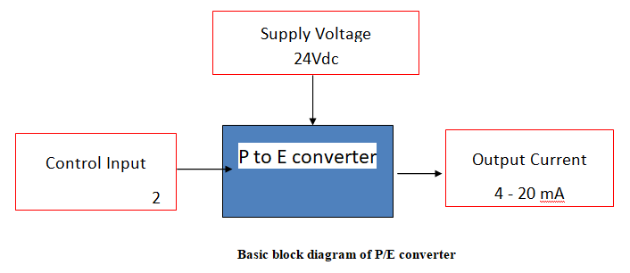

## Prerequisite:
* Basic block diagram of Feedback control system
* Working of Piezo-resistive sensor
* Working of LVDT
* Working of voltage to current converter

## Necessity of P to E converter:

In certain areas of process plants use of electrical transmitters are not recommended. The basic nature of process as unsafe for any spark or flash due to which the plant may be exposed to fire. Many other ways of mitigating this hazard are available like use of pneumatic transmitters, ex-proof housings, zener barriers etc. In most of the modern plants the control system is electronic due to its inherent strengths the sensing must be done using pneumatic principle. The P to E 
converter is used to interface these transmitters to electronic control systems. Hence it is essential to use these converters in process plants.        

## Theory:

The input signal which is air pressure in the range 0.2 to 1.0 kg/cm2    which is output of the pneumatic transmitter is applied to a solid-state piezo-resistive transducer/LVDT which converts the air pressure into corresponding resistance/voltage.  This transducer is connected in Wheatstone's bridge circuit in case of a strain gauge. When there is no pressure the bridge is balanced. According to the variations in the input control signal, small output voltage is available  as the bridge is unbalanced. The voltage obtained is amplified and further converted in mA current. When the input signal is 0.2 kg/cm2  the output is adjusted to 4 mA with zero adjustment and for 1.0 kg/cm2 the output is adjusted to 20 mA with span adjustment. For further details of working of strain gauge refer "Sensors Modelling Lab" of COEP. (https://portal.coepvlab.ac.in/vlab/auth/home?dept=3&lab=1&exp=5&sim=5)    

In case of LVDT the core is moved upwards after applying the pneumatic signal which will in turn will change the output voltage of the LVDT. This voltage is converted to current signal as the requirement of interfacing signal is current. For further details of working of LVDT please refer to "Sensors Modelling Lab" of COEP. (https://portal.coepvlab.ac.in/vlab/auth/home?dept=3&lab=1&exp=4&sim=4)   

### Calibration of P/I converter

#### Generally P/I converter is calibrated for standard industrial signals as 0.2-1.0 kg/cm^2 (3-15 psig) input corresponds to 4-20 mA DC output. 

### To adjust the zero and span settings 

#### Generally Two adjustments for zero and span are provided on front panel of unit.
1. Connect control input 0.2-1.0 kg/cm^2 i.e. 3-15 psig.

2. Set the input signal to 0.2 kg/cm^2 (3 psig) and check the output current as 4 mA.

3. If the current is showing more or less than 4 mA then adjust zero. Turn zero adjustment screw slowly by small turn to obtain 4 mA current. 

4. Set the input pressure signal to 1.0 kg/cm^2 (15 psig) and check the output current 20 mA.

5. Turn the span adjustment potentiometer slowly by small turn to obtain 20 mA current. 

6. Repeat step 3 to check that the desired low value (3 psig ~ 4mA) has not changed after adjusting the span. If necessary repeat steps 3 through 5 to fine-tune the unit.
